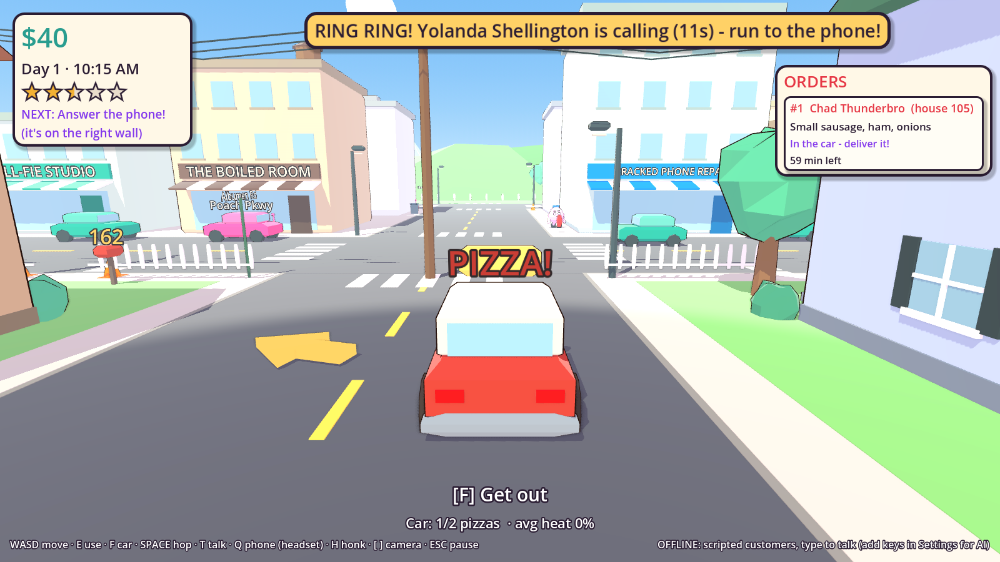

# 🍕 Pizza Panic!

*You are an egg. You deliver pizza. The customers are worse.*

A goofy, faceted, cel-shaded 3D pizza shop game built in **Godot 4.7**. Everyone in Eggville is an
egg, including you. You run Tony's Pizza: answer the phone, make pizzas in the kitchen, drive them
across town, and **talk to customers with your real voice**. They're AI characters, and they
answer back.



## The game

Each day runs from 10 AM to 10 PM (about 12 real minutes):

1. **The phone rings.** A customer calls and orders in character. Gary orders "a pizza for his tuba".
   The dog barks his order. The order appears as a ticket.
2. **Make the pizza** in Tony's kitchen:
   - **Dough fridge**: hold E to stretch the dough. Let go on the right size.
   - **Prep table**: pick a sauce, squeeze it (hold E, let go in the green zone), mash E to grate
     cheese, then add the toppings on the ticket with the number keys.
   - **Oven**: take it out when it says PERFECT. Leave it in and it burns.
   - **Cut & box**: tap E when the knife is in the zone.
3. **Load the car** and **drive** across town. Follow the yellow arrow. Crashes smush the pizzas,
   and pizzas cool down on the road.
4. **Knock on the door** with the box held over your head, and **talk** to the customer. Play
   along with their weirdness, and they pay and tip based on how good, hot, on-time and un-smushed
   the pizza is.
5. **Closing time**: see your day's report, then spend your money on upgrades.

**Upgrades** (Tony's PC in the kitchen, or after each day):
- **Car**: engine, grippy tires, bouncy suspension, hot bag, roof rack (up to 6 pizzas), pizza
  rocket boost, silly horns (clown, awooga, air horn, goat), paint jobs.
- **Kitchen**: turbo oven, second oven, dough press, sauce gun, cordless headset (answer calls
  anywhere, even while driving), neon sign (more calls), weird toppings (gummy bears!), heat lamp.
- **You**: fast sneakers, and hats (beanie → propeller cap → cowboy → top hat → CROWN).

Reputation (stars) goes up with great deliveries and down with late, cold or stolen ones, and
missed calls. More stars means more calls and bigger tips. Your progress saves after every day.

**The town** has downtown shops, Yolk Park (pond, ducks, fountain, playground), the Shell-Out gas
station, ~58 houses each with its own resident, traffic, egg pedestrians you can (accidentally)
yeet, streetlights that switch on at sunset, power lines, hills, mountains and a water tower.

**The cast**: 12 handmade characters (Gary the tuba guy, Grandma Edna who thinks you're Kevin,
Sir Barksalot the dog, Chad Thunderbro, Conspiracy Carl, Dave the Wizard, Big Baby Bob, Boo-ford
the ghost, Princess Sparkle-chan, Sensei Noodle, Mr. Synergy, Kyle who thinks this is a game),
your boss Tony Pepperoni, plus dozens of generated weirdos (a pirate, an opera singer, a guy who
thinks it's 1850, a robot (allegedly)...).

## Run it on your Mac

1. Download **Godot 4.7** (standard, not .NET) from https://godotengine.org/download/macos
2. In Godot's Project Manager, drag `pizza-panic.zip` in (or **Import** → pick `project.godot`),
   then **Import & Edit**.
3. Press **▶ Play** (top right) or `Cmd+B`.

It works right away in **offline mode**: you type to customers and they answer from a script.
To get voice chat and AI customers, add API keys (below). The first time you hold **T**, macOS
asks for microphone permission. Say yes.

## Controls

| Action | Keyboard | Controller |
|---|---|---|
| Walk / drive | WASD or arrows | Left stick, RT/LT |
| Use / pick up / knock | **E** | X |
| Get in / out of the car | **F** | L3 |
| Hold to talk (voice chat) | **hold T** | hold Y |
| Hop | Space | A |
| Answer phone anywhere (headset upgrade) | Q | D-pad up |
| Honk | H | B |
| Rocket boost (upgrade) | Shift | R3 |
| Turn camera | [ and ] | D-pad left/right |
| Unflip car | R | Back |
| Pause / hang up / leave | Esc | Start |

In conversations you can also type and press Enter. In the kitchen, number keys pick sauces and
toppings, and Enter finishes.

## AI setup (voice chat + AI customers)

| Service | What it does | Get a key |
|---|---|---|
| **Anthropic (Claude)** | The customers' brains: what they say, what they order, if they accept the pizza, the tip | console.anthropic.com → Billing (add credit) → API Keys |
| **OpenAI** | Turns your voice into text, and gives customers acted voices | platform.openai.com → Billing (add credit) → API keys |
| **ElevenLabs** *(optional)* | More realistic voices | elevenlabs.io → Profile → API key |

Paste them in **Settings / AI Voice Setup** and press **Test AI**.

**"How customers answer"** setting:
- **Voice + text**: they talk out loud and the words show on screen.
- **Text only**: you talk with your voice, they text back. It's cheaper (no voice generation),
  and needs just Anthropic + OpenAI keys.

**Cost:** pay-as-you-go. One back-and-forth (your voice in, their reply, their voice out) costs
roughly 1–2 cents; text-only is a bit cheaper. $5 of credit on each service lasts hundreds of
conversations. Set a monthly spending limit in each dashboard.

How one exchange works:

```
hold T → mic records → speech-to-text → "here's your tuba, Gary"
  → Claude (playing Gary) gets that + the scene: on the phone or at the door, what pizza
    you're holding, is it hot/burnt/smushed/late, how much Gary likes you
  → JSON back: {say, emotion, mood_change, action, tip, order}
  → text appears → voice plays → mouth flaps → game applies the action
```

Claude decides what happens (`place_order`, `accept_pizza`, `refuse_pizza`, `slam_door`,
`steal_pizza`, `hang_up`), and the game enforces the rules: nobody can accept a pizza that isn't
theirs, and orders only use real menu items. If an AI service fails, that customer quietly falls
back to the offline script so the game never gets stuck.

> Keys are saved in plain text in Godot's user data folder (`settings.cfg`). Don't put your keys
> into a build you give to other people.

## Project layout

Everything is built from code and procedural low-poly shapes: **no model, texture or audio
files**. Even the music and sound effects are synthesized at startup.

```
scenes/main.tscn              entry point
scripts/main.gd               game flow: title → day → report → next day; input; car enter/exit; GPS arrow; hints
scripts/autoload/             settings (keys, controls), game (money, clock, tickets, reputation, upgrades, save), sfx (synth sounds + music)
scripts/data/                 characters.gd (★ THE CAST), menu.gd (sizes/sauces/toppings/prices), upgrades.gd
scripts/art/                  shapes.gd (faceted meshes: egg, lathe, chamfered blocks, blobs), toon.gd (materials/builders)
scripts/characters/           egg_body.gd (the egg character + animation), player.gd, pedestrians.gd
scripts/kitchen/              kitchen.gd (all stations), pizza.gd (the pizza + quality scoring), phone_line.gd, station.gd
scripts/vehicles/             car.gd (delivery car + upgrades + cargo), traffic.gd
scripts/world/                town.gd (Eggville generator), house.gd, pizzeria.gd, landmarks.gd, day_cycle.gd
scripts/ai/                   conversation.gd, claude_brain.gd, speech_to_text.gd, text_to_speech.gd, mic_recorder.gd, offline_brain.gd
scripts/ui/                   hud, dialogue box, minigames, make-line, menus + upgrade shop, theme
shaders/                      toon.gdshader (3-band faceted cel shading), outline.gdshader (ink lines)
tests/                        automated play-throughs
tools/                        screenshot + character lineup renderers
```

### Adding a character

Open `scripts/data/characters.gd`, copy an entry in `ROSTER`, and change:
- `prompt`: who they are and what you must do at the door to get paid
- `phone` / `favorites`: how they open a phone call and what they like to order
- `voice`: an OpenAI voice name (alloy, ash, ballad, coral, echo, fable, nova, onyx, sage, shimmer,
  verse) plus acting notes; an ElevenLabs voice ID; a babble pitch
- `look`: egg color, size, `stretch` (tall/round), hat (`cap`, `chef`, `wizard`, `tinfoil`,
  `crown`, `beanie`, `propeller`, `tophat`, `headband`, `headset`, `bun`, `bow`, `cowboy`), and
  extras (`mustache`, `beard`, `glasses`, `tie`, `apron`, `cape`, `ears`, `snout`, `tail`,
  `ghost`, `baby`, `blush`, `grumpy`...)

### Tests

```sh
# A whole day: phone → kitchen → car → delivery → upgrade → closing → save
godot --headless --path pizza-panic res://tests/smoke_test.tscn

# The AI pipeline against a fake AI server (no keys needed)
python3 pizza-panic/tests/mock_ai_server.py 8787 any.mp3 /tmp/requests.log &
godot --headless --path pizza-panic res://tests/ai_pipeline_test.tscn
```

## Ideas for later

Events (rush hour, a food critic, a pizza-hating mayor), more neighborhoods unlocked by
reputation, hiring helpers, achievements, a photo mode, controller rumble, real music tracks, and
exporting for Windows/Steam when you're ready (`export_presets.cfg` already has the macOS
microphone permission set up).
