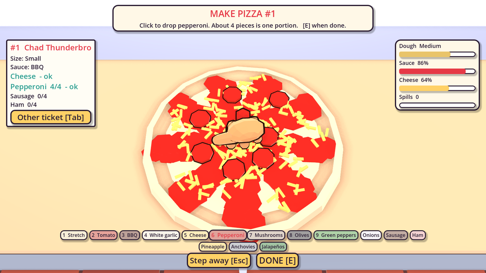
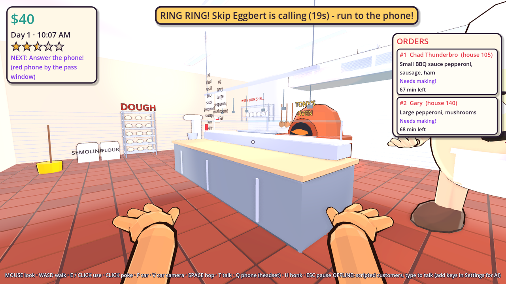
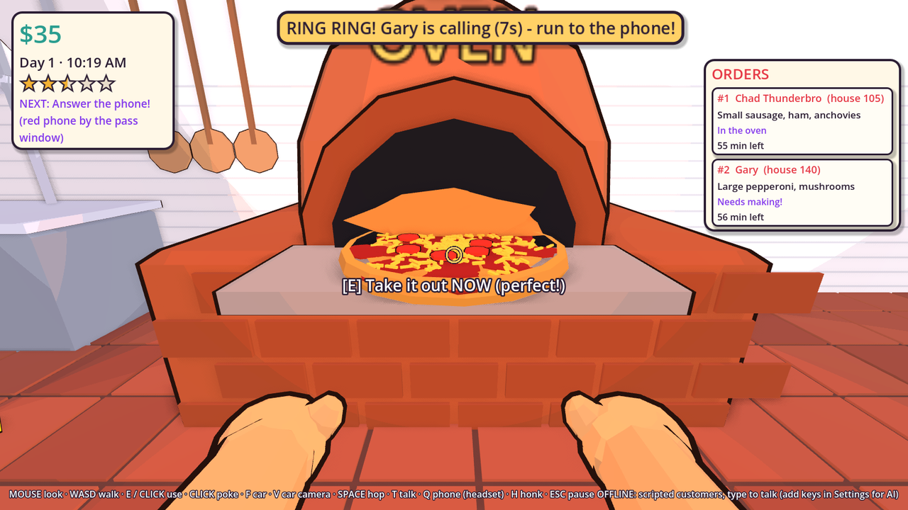
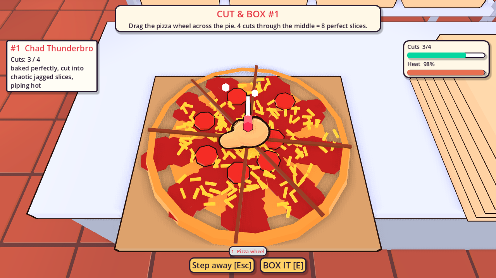
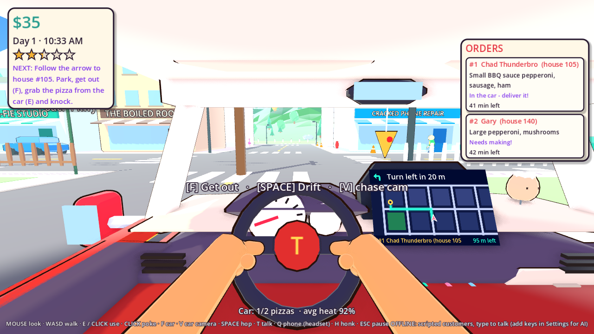
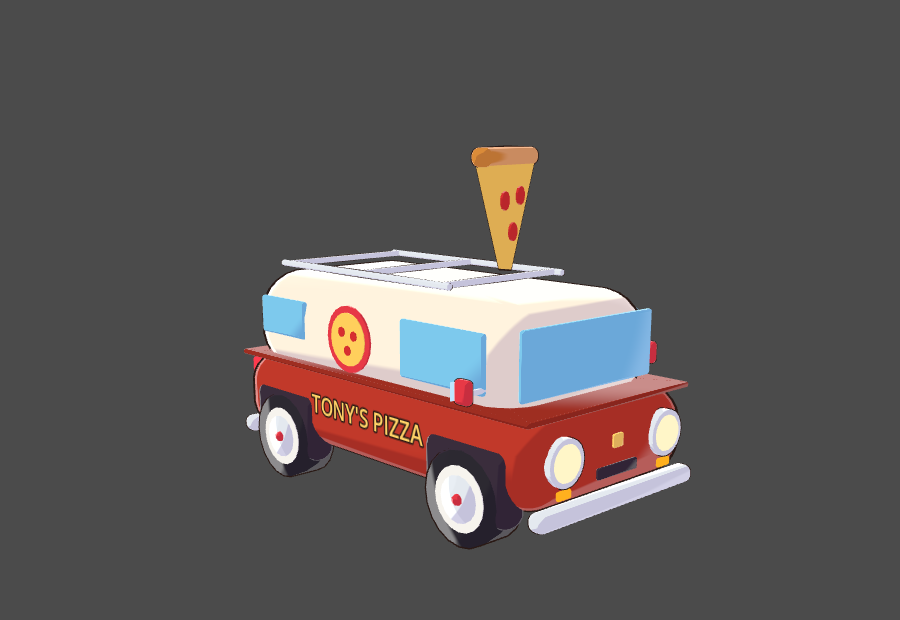
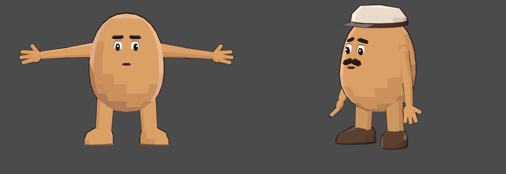
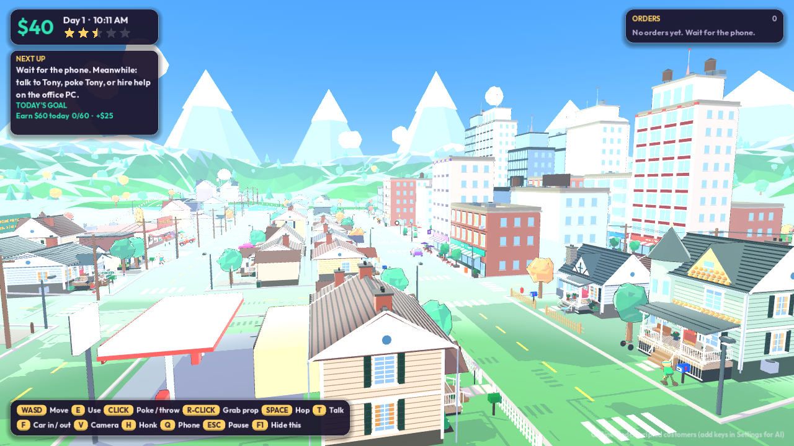

# 🍕 Pizza Panic!

*You are an egg. You deliver pizza. The customers are worse.*

A goofy, faceted, cel-shaded **first-person** pizza shop game built in **Godot 4.7**. Everyone in
Eggville is an egg, including you (you can see your own chunky mittens). You work at Tony's Pizza:
answer the phone, make every pizza **by hand**, drive it across town from the driver's seat, and
**talk to customers with your real voice**. They're AI characters, and they answer back.



## The game

Each day runs from 10 AM to 10 PM (about 12 real minutes):

1. **The phone rings.** Run to the red phone by the pass window (or hire Pam to answer it). The
   customer orders in character, and a ticket appears on the rail over the make-line.
2. **Make the pizza with your hands.** Nothing is a button-press minigame:
   - **Dough rack** (back left wall): grab a dough ball.
   - **Prep board** (middle island): put it down and the camera looks down at the board.
     - **Stretch**: hold left-click and drag out from the middle to the yellow ring. Right-click
       **tosses** the dough in the air, which stretches it too. Sometimes it lands on your face.
       Too thin and it rips.
     - **Sauce**: hold the mouse and paint it on. Coverage counts, and slopping it off the edge
       counts against you. Spill enough and there's a puddle on the floor to slip on.
     - **Cheese**: hold and wiggle to sprinkle.
     - **Toppings**: pick one (1-9 or click), then click to drop pieces. About 4 pieces is one
       portion.
   - **Oven** (back wall): slide it in and watch the crust brown. Pull it out when it says
     PERFECT. Leave it in and it smokes, the alarm goes off, and it burns.
   - **Cutting board** (right island): drag the pizza wheel across it. 4 straight cuts through the
     middle make 8 perfect slices, and crooked cuts get noticed. Then fold the box shut.
   - **Pass shelf**: boxed pizzas wait under the heat lamps.
3. **Load the car and drive.** Tony's little delivery van is a rounded two-tone bread van
   with a giant pizza slice on the roof. You drive it from the driver's seat:
   - Your hands are on the wheel, Tony bobbles on the dash, and a pizza air freshener swings.
   - The **dashboard GPS** shows a live map, the route along real streets, "Turn left in 40 m",
     and how far you have left.
   - Hold **Space** to handbrake-drift. Anime speed lines appear when you floor it.
   - Press V for the chase cam.

   Crashes smush the pizzas, and pizzas cool down on the road.
4. **Knock** with the box in your hands, and **talk** to the customer. Play along with their
   weirdness, and they pay and tip based on how good, hot, on-time and un-smushed the pizza is.
   Quality comes from what you actually did: dough size, sauce and cheese coverage, spills, toppings,
   bake, and cuts.
5. **Closing time**: see your day's report, pay wages, then spend money on upgrades and staff.

**Hire help** (Tony's office PC). Cooks walk the kitchen and make whole pizzas start to finish, then
put them on the pass shelf. Everyone has a quirk:
- Lazy Larry naps, sometimes at the oven.
- Clumsy Carla spills sauce on the floor.
- Snacky Steve eats toppings.
- Speedy Gonzalegg runs into walls.
- Nonna Yolanda is slow but perfect.
- Pam answers the phone politely.
- Gary's Cousin Barry hangs up on people.

You can train staff, and you can fire them.

**Goofy stuff**: click on nothing to **poke** whoever's in front of you (Tony hates it). You can slip
on sauce or wet floors, and if you walk into traffic you get bonked over like an egg and wobble back up.
- Sir Barksalot chases your car down the street.
- Chad makes you **arm wrestle** him for the tip (mash E).
- Dave the Wizard turns the pizza box into a frog.
- Big Baby Bob crawls off mid-conversation.
- Boo-ford the ghost floats right through his closed door.

**Upgrades**:
- **Car**: engine, tires, suspension, hot bag, roof rack, rocket boost, silly horns, paint.
- **Kitchen**: turbo oven, second oven, dough press (faster stretching, bigger sweet spot), sauce gun
  (bigger splats), cordless headset (answer anywhere), neon sign, weird toppings, heat lamps.
- **You**: sneakers and hats.

Reputation (stars) goes up with great deliveries and down with late, cold or stolen ones, and missed
calls. More stars means more calls and bigger tips. Your progress (and staff) saves after every day.

| | |
|---|---|
|  |  |
|  |  |

**The look**: smooth, bright anime-style cel shading with soft rim light and a saturated sky,
plus simple goofy googly eyes that wobble when the eggs move.



**The eggs**: every character shares one model. It's a big low-poly egg standing on its fat end, with long skinny
tapered arms, big four-fingered cartoon hands, thick straight legs and chunky toes-out shoes. Hats,
mustaches, aprons and the rest go on top, and the faces animate.





**The land**: Eggville sits in a bowl of rolling hills with pine and autumn forests, rocks, a lake,
a windmill and red barn up on a ridge, and snow-capped mountains on the horizon.

**The town** has downtown shops, Yolk Park, a gas station, ~58 houses each with its own resident,
traffic, egg pedestrians, streetlights that switch on at sunset, and hills and mountains.

**The cast**: 12 handmade characters (Gary the tuba guy, Grandma Edna who thinks you're Kevin,
Sir Barksalot the dog, Chad Thunderbro, Conspiracy Carl, Dave the Wizard, Big Baby Bob, Boo-ford
the ghost, Princess Sparkle-chan, Sensei Noodle, Mr. Synergy, Kyle who thinks this is a game),
your boss Tony Pepperoni, plus dozens of generated weirdos.

## The town

- **Suburbs** with six house styles (craftsman, colonial, cottage, ranch, victorian, modern), each with a
  deep raised porch (railings, balusters, columns, beadboard ceiling, steps, swing or chairs, potted plants),
  real windows with sills and shutters, shingled roofs, chimneys, garages and driveways, stepping-stone
  paths, mowing stripes, mailboxes, fences and little garden extras.
- **Downtown** with glass towers, brick mid-rises, art-deco landmarks, storefronts with awnings and café
  patios, and a plaza with a fountain, clock tower and hot dog cart.
- Every sign is a real framed board with painted lettering (`scripts/art/signs.gd`).
- Orders arrive slower now (3 open at a time to start) and every order is a receipt: HUD cards,
  a notepad during the call, and slips on the kitchen rail.

## Hills and hands

- **The town is built on hills.** One ground mesh (with matching collision) runs under the whole town. Downtown, the
  plaza, the park, the gas station and Tony's block stay level; the suburbs climb in terraced levels up to about 9 m.
  Roads, curbs, lane paint, houses, yards, traffic, pedestrians and props all follow the ground. Houses sit on taller
  foundations on the downhill side, with longer porch steps.
- **First-person arms** are real two-bone arms from your shoulders (elbow and short sleeve), with named finger grips.
  Picking something up reaches for it, closes the fingers and lifts it into carry; putting it down opens the hands;
  throwing winds up and snaps forward before letting go.

## Feel (driving, kitchen, weather, goals)

- **Driving:** a real power curve (strong off the line, fading near top speed), steering that gets less sharp the faster
  you go, weight transfer (nose dips braking, squats accelerating, body rolls in corners), a four-gear engine with
  shifts, tyre squeal and drift smoke, and a camera kick on crashes. The wheel turns about its own axis with your hands on it.
- **Kitchen:** flour puffs and a dough jiggle when you stretch, toppings make the pizza wobble, a bell and steam when the
  oven hits perfect, a steam burst when you pull a pizza out.
- **Weather:** each morning is clear, overcast, rainy (slippery roads, thunder) or foggy.
- **Goals:** a new goal every day with a cash reward, and a delivery streak that adds a growing tip bonus.

## Animation

- **Ragdoll falls.** Any real hit (thrown props, cars, goats, grease, explosions) turns the egg into a verlet
  ragdoll (`scripts/characters/ragdoll.gd`): it flies, flops, bounces and slides with loose limbs, lies there dazed,
  then pops back up with an overshoot. Small hits just make it flinch.
- **A proper walk and run.** Knees, foot roll, hip sway against opposite arm swing, a squish on every footstep.
- Hats, hair and beards are smooth shells that fade into the skull (no rims, no clipping).
- Signs use the bundled Erica One font and auto-fit their text to the board. The UI uses Outfit. Both are OFL (`fonts/`).

## Chaos (the slapstick layer)

- **Grab and throw anything.** Loose props lie around the pizzeria: rubber chickens, frying pans,
  tomatoes, cones, mop buckets, watermelons, plungers, rolling pins, baguettes and one very heavy
  anvil. **Right click / G** grabs what you are looking at, **click** throws it, right click again drops it.
  Anything fast bonks the egg it hits: pedestrians get launched, workers sprawl and lie there confused,
  Tony yells. Tomatoes and watermelons splat.
- **A silly rule every day.** Moon Pizza Day (low gravity), Ice Floor Friday (everything slides),
  Sugar Rush (you are very fast).
- **A disaster every minute or so:** rubber chicken rain, a grease spill across the kitchen, the oven
  catching fire (mash **E** to stomp it out, or throw a mop bucket at it), a goat that charges at
  everybody, a blackout, and aliens stealing your van and dumping it somewhere else in town.
- Code: `scripts/chaos/` (`throwable.gd`, `disasters.gd`, `chaos.gd`). Preview shots: `tools/chaos_shots.tscn`.

## Run it on your Mac

1. Download **Godot 4.7** (standard, not .NET) from https://godotengine.org/download/macos
2. In Godot's Project Manager, drag `pizza-panic.zip` in (or **Import** → pick `project.godot`),
   then **Import & Edit**.
3. Press **▶ Play** (top right) or `Cmd+B`.

It works right away in **offline mode**: you type to customers and they answer from a script.
To get voice chat and AI customers, add API keys (below). The first time you hold **T**, macOS
asks for microphone permission. Say yes.

## Controls

| Action | Keyboard / mouse | Controller |
|---|---|---|
| Look around | Mouse | Right stick |
| Walk / drive | WASD or arrows | Left stick, RT/LT |
| Use / pick up / knock (what the crosshair is on) | **E** or left-click | X |
| Poke (click on nothing) / throw what you hold | Left-click | RB |
| Grab a loose prop / drop it | **Right-click** or **G** | not bound yet |
| Hop (on foot) / handbrake drift (driving) | Space | A |
| Get in / out of the car | **F** | L3 |
| Cockpit / chase camera | **V** | D-pad down |
| Hold to talk (voice chat) | **hold T** | hold Y |
| Answer phone anywhere (headset upgrade) | Q | D-pad up |
| Honk | H | B |
| Rocket boost (upgrade) | Shift | R3 |
| Unflip car | R | Back |
| Pause / hang up / step away from a station | Esc | Start |

**At a station** (prep board or cutting board) the mouse cursor shows up:
- Left-click: stretch, paint, sprinkle, drop, or cut.
- Right-click: toss the dough.
- 1-9: pick a tool.
- Tab: switch which ticket you're making.
- E: done.
- Esc: step away (your pizza waits for you).

Mouse sensitivity is in Settings. In conversations you can also type and press Enter.

## AI setup (voice chat + AI customers)

| Service | What it does | Get a key |
|---|---|---|
| **Anthropic (Claude)** | The customers' brains: what they say, what they order, if they accept the pizza, the tip | console.anthropic.com → Billing (add credit) → API Keys |
| **OpenAI** | Turns your voice into text, and gives customers acted voices | platform.openai.com → Billing (add credit) → API keys |
| **ElevenLabs** *(optional)* | More realistic voices | elevenlabs.io → Profile → API key |

Paste them in **Settings / AI Voice Setup** and press **Test AI**.

**"How customers answer"** setting:
- **Voice + text**: they talk out loud and the words show on screen.
- **Text only**: you talk with your voice, they text back. It's cheaper (no voice generation),
  and needs just Anthropic + OpenAI keys.

**Cost:** pay-as-you-go. One back-and-forth (your voice in, their reply, their voice out) costs
roughly 1–2 cents; text-only is a bit cheaper. $5 of credit on each service lasts hundreds of
conversations. Set a monthly spending limit in each dashboard.

How one exchange works:

```
hold T → mic records → speech-to-text → "here's your tuba, Gary"
  → Claude (playing Gary) gets that + the scene: on the phone or at the door, what pizza
    you're holding, is it hot/burnt/smushed/late, how much Gary likes you
  → JSON back: {say, emotion, mood_change, action, tip, order}
  → text appears → voice plays → mouth flaps → game applies the action
```

Claude decides what happens (`place_order`, `accept_pizza`, `refuse_pizza`, `slam_door`,
`steal_pizza`, `hang_up`), and the game enforces the rules: nobody can accept a pizza that isn't
theirs, and orders only use real menu items. If an AI service fails, that customer quietly falls
back to the offline script so the game never gets stuck.

> Keys are saved in plain text in Godot's user data folder (`settings.cfg`). Don't put your keys
> into a build you give to other people.

## Project layout

Everything is built from code and procedural low-poly shapes: **no model, texture or audio
files**. Even the music and sound effects are synthesized at startup.

```
scenes/main.tscn              entry point
scripts/main.gd               game flow: title → day → report → next day; input; mouse capture; car enter/exit; GPS arrow; hints
scripts/autoload/             settings (keys, controls), game (money, clock, tickets, reputation, upgrades, save), sfx (synth sounds + music)
scripts/data/                 characters.gd (★ THE CAST), menu.gd (sizes/sauces/toppings/prices), upgrades.gd, staff_data.gd (hireable eggs)
scripts/art/                  shapes.gd (faceted meshes: egg, lathe, chamfered blocks, blobs), toon.gd (materials/builders)
scripts/characters/           egg_body.gd (the egg character + spring animation rig), player.gd (first-person egg), pedestrians.gd
scripts/player/               fp_hands.gd (your mittens), game_camera.gd (title orbit + chase cam)
scripts/kitchen/              kitchen.gd (hands-on stations), pizza.gd (sauce splats, cheese, cuts, box, scoring), worker.gd + staff.gd (hired eggs), phone_line.gd, station.gd
scripts/vehicles/             car.gd (delivery car + upgrades + cargo), traffic.gd
scripts/world/                town.gd (Eggville generator), house.gd, pizzeria.gd (Tony's: dining room, kitchen, walk-in, office), gags.gd, landmarks.gd, day_cycle.gd
scripts/ai/                   conversation.gd, claude_brain.gd, speech_to_text.gd, text_to_speech.gd, mic_recorder.gd, offline_brain.gd
scripts/ui/                   hud (+ crosshair), dialogue box, station overlay, menus + upgrade/hiring shop, theme
shaders/                      toon.gdshader (3-band faceted cel shading), outline.gdshader (ink lines)
tests/                        automated play-throughs
tools/                        screenshot, character lineup, animation sheet + model sheet (T-pose) renderers
```

### Adding a character

Open `scripts/data/characters.gd`, copy an entry in `ROSTER`, and change:
- `prompt`: who they are and what you must do at the door to get paid
- `phone` / `favorites`: how they open a phone call and what they like to order
- `voice`: an OpenAI voice name (alloy, ash, ballad, coral, echo, fable, nova, onyx, sage, shimmer,
  verse) plus acting notes; an ElevenLabs voice ID; a babble pitch
- `look`: egg color, size, `stretch` (tall/round), hat (`cap`, `chef`, `wizard`, `tinfoil`,
  `crown`, `beanie`, `propeller`, `tophat`, `headband`, `headset`, `bun`, `bow`, `cowboy`), and
  extras (`mustache`, `beard`, `glasses`, `tie`, `apron`, `cape`, `ears`, `snout`, `tail`,
  `ghost`, `baby`, `blush`, `grumpy`...)

### Tests

```sh
# A whole day: phone → hand-made pizza → car → delivery → hired cook → closing + wages → save
godot --headless --path pizza-panic res://tests/smoke_test.tscn

# The AI pipeline against a fake AI server (no keys needed)
python3 pizza-panic/tests/mock_ai_server.py 8787 any.mp3 /tmp/requests.log &
godot --headless --path pizza-panic res://tests/ai_pipeline_test.tscn
```

## Ideas for later

Events (rush hour, a food critic, a pizza-hating mayor), more neighborhoods unlocked by
reputation, delivery drivers you can hire, achievements, a photo mode, controller rumble, real music tracks, and
exporting for Windows/Steam when you're ready (`export_presets.cfg` already has the macOS
microphone permission set up).


## Exporting the models

Every model in the game is built by code, so there are no model files in the project. To get real
files for Blender, Unity, Unreal and so on, run:

```sh
godot --headless --path pizza-panic res://tools/export_assets.tscn -- out=/some/folder
```

That writes about 48 `.glb` files: every character (plus T-poses with a joint hierarchy), the
staff, the delivery van, traffic cars, all the pizza stages, Tony's pizzeria, house styles, trees,
the terrain and the whole town. A ready-made copy is in `pizza-panic-assets.zip` next to this
project. Colors are flat; the cel shading and ink outlines are shader effects, so you recreate them
in your own tool.

## Local llama (Ollama) brains
Settings -> AI mode -> "Local llama (Ollama)". Run `ollama serve` and `ollama pull llama3.2`
(any model that follows JSON schemas works; bigger = smarter NPCs). Server URL defaults to
`http://localhost:11434`. Voice-to-text and NPC voices still use their own providers (or babble/text-only).
